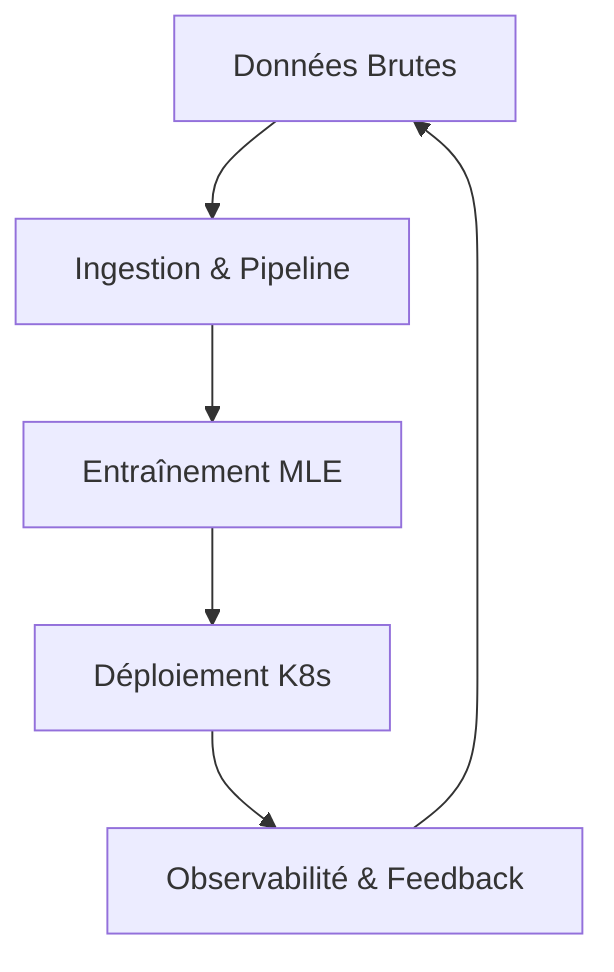

# L'Évolution des Métiers de la Data

Le débat est vieux comme le Big Data, mais en 2026, la réponse est plus subtile que jamais. Alors que les outils d'AutoML et les LLMs automatisent les tâches répétitives, la valeur ajoutée humaine s'est déplacée vers des pôles très distincts : la **compréhension stratégique** et l'**excellence technique**.

## 1. Le Data Scientist : L'Architecte de la Connaissance

Aujourd'hui, le Data Scientist ne passe plus ses journées à nettoyer des CSV. Son rôle a évolué vers l'**Inference Cause-to-Effect** et la conception d'expériences.

### Ses priorités :
- **Identification des leviers métier** : Pourquoi nos utilisateurs partent-ils ?
- **Design de protocoles expérimentaux** : Tests A/B complexes et analyses de biais.
- **Communication narrative** : Traduire des probabilités en décisions stratégiques pour le board.

## 2. Le Machine Learning Engineer (MLE) : L'Artisan de la Scalabilité

Le MLE est le pont entre l'algorithme et l'infrastructure de production. Sa mission est de s'assurer que le modèle est non seulement précis, mais performant, robuste et monitorable.

### Ses priorités :
- **MLOps & CI/CD** : Automatiser le ré-entraînement et le déploiement.
- **Optimisation de l'Inférence** : Latence, quantification, gestion des caches.
- **Architectures Distribuées** : Gérer des modèles qui ne tiennent pas sur un seul serveur.

## 3. Comparaison des Compétences

| Compétence | Data Scientist | ML Engineer |
| :--- | :---: | :---: |
| Statistiques & Probabilités | 🟢 Expert | 🟡 Maîtrise |
| Génie Logiciel (Rust, Go) | 🔴 Basique | 🟢 Expert |
| Interprétabilité & Biais | 🟢 Expert | 🟡 Maîtrise |
| Kubernetes & Docker | 🔴 Optionnel | 🟢 Crucial |

## Quel profil privilégier ?

Si votre challenge est de **comprendre un marché** ou de **découvrir des opportunités cachées** : embauchez un **Data Scientist**.
Si votre challenge est de **servir des millions de prédictions** par seconde ou d'**intégrer l'IA au cœur d'un logiciel** : embauchez un **ML Engineer**.

> **Mon conseil** : En 2026, la meilleure équipe est celle qui favorise la "cross-pollination". Un Data Scientist avec des notions de code propre et un MLE avec une culture statistique solide sont des atouts inestimables.

## Conclusion

Les intitulés de postes importent moins que les problèmes que vous résolvez. L'essentiel est de rester curieux et de comprendre que la Data Science sans Engineering reste un prototype, et que l'Engineering sans Science reste une boîte noire.
