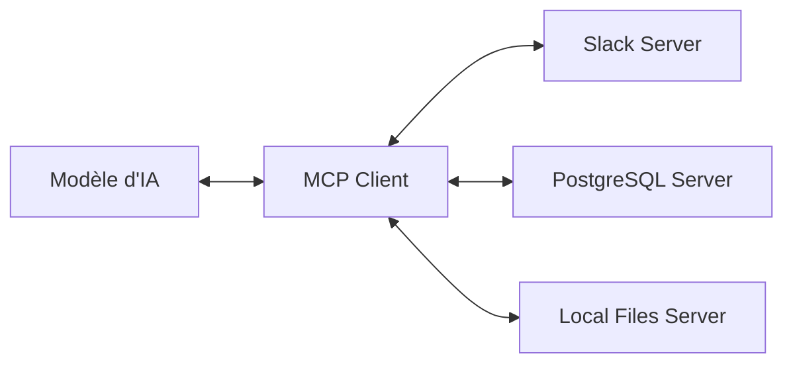

# L'Uniformisation de la Communication IA

Pendant des années, connecter une IA à un outil externe (une base de données, un repo GitHub, ou Slack) nécessitait du code sur mesure, des connecteurs fragiles et une maintenance constante. Le **Model Context Protocol (MCP)**, introduit par Anthropic et devenu un standard industriel, change la donne.

## 1. Qu'est-ce que le MCP ?

Le MCP est un protocole de communication ouvert qui sépare l'IA de ses sources de données. Il permet de construire des serveurs "sources" (MCP Servers) que n'importe quel LLM compatible peut interroger de manière standardisée.



## 2. Pourquoi c'est une révolution ?

- **Interopérabilité** : Un connecteur écrit pour le MCP fonctionne immédiatement avec Claude, GPT-5 ou Llama 4.
- **Sécurité** : Le protocole définit des interfaces strictes. L'IA demande l'accès à une ressource, et le serveur MCP valide les permissions.
- **Contextualisation Profonde** : Le MCP permet à l'IA d'aller chercher elle-même les documents techniques ou les logs dont elle a besoin pour résoudre un problème.

## 3. Implémenter son premier serveur MCP

Créer un serveur MCP est d'une simplicité déconcertante grâce aux SDKs disponibles en Python et TypeScript.

```python
from mcp_sdk import Server

mcp_server = Server("MyDataHub")

@mcp_server.tool()
async def query_company_wiki(query: str):
    """Recherche des informations dans le wiki interne de l'entreprise."""
    # Logique de recherche sémantique
    return {"results": ["..."]}

mcp_server.run()
```

## L'Avenir du MCP

En 2026, le MCP est devenu la "couche de transport" standard pour les systèmes d'IA. Chaque API SaaS expose désormais nativement un endpoint MCP, rendant l'orchestration d'agents complexes aussi simple qu'un branchement USB.

> **Note d'expert** : Si vous développez une application aujourd'hui, ne construisez pas de connecteurs propriétaires. Utilisez le MCP dès le départ pour assurer la pérennité de votre architecture.

## Ressources Utiles

- [Spécifications officielles du protocole MCP](https://modelcontextprotocol.io)
- [Catalogue des serveurs MCP open-source](https://github.com/mcp-community/servers)

## Conclusion

Le MCP n'est pas juste un protocole technique ; c'est le ciment qui permet de construire une IA réellement utile, connectée et sécurisée.
